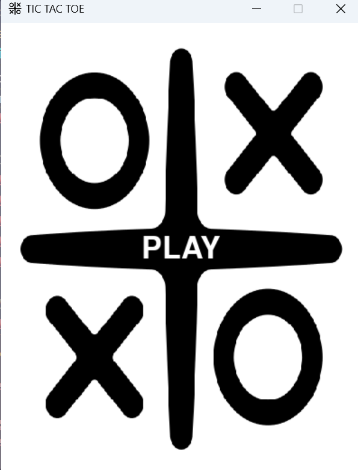
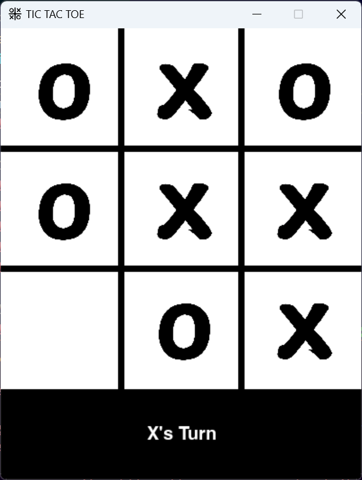

# Tic Tac Toe Game Using Python

A simple and interactive Tic Tac Toe game built using Python and Pygame. The game features a home screen with a title, logo, and a play button. Players can enjoy a visually appealing interface with turn-based gameplay and win/draw detection.

---

## Screenshots

### Home Screen



### Gameplay



## Features

- **Home Screen**: Includes a logo, game title, and a play button.
- **Turn-Based Gameplay**: Players alternate between `X` and `O`.
- **Win/Draw Detection**: Highlights winning rows, columns, or diagonals and detects draw conditions.
- **Game Reset**: Automatically resets the game after a win or draw.
- **Responsive Design**: Dynamic updates to the game window.

---

## Prerequisites

- Python 3.6 or higher
- Pygame library

### Install Pygame

To install Pygame, run:

```bash
pip install pygame
```

---

## How to Run

1. Clone or download this repository.
2. Ensure all assets (e.g., `logo.png`, `x.png`, `o.png`) are present in the `assets` folder.
3. Run the game using:
   ```bash
   python tic_tac_toe.py
   ```
4. Click the "PLAY" button on the home screen to start the game.

---

## Gameplay Instructions

1. Click on the grid to place your `X` or `O`.
2. Alternate turns between players.
3. The game will detect a winner or a draw:
   - Winning lines are highlighted.
   - A message is displayed indicating the result.
4. The game resets automatically after 2 seconds.

---

## Folder Structure

```
project/
├── assets/
│   ├── logo.png
│   ├── x.png
│   └── o.png
├── tic_tac_toe.py
└── README.md
```

---

## Credits

- **Developer**: Aditya Manoj Shinde
- **Framework**: Pygame

---

## Future Enhancements

- Add AI for single-player mode.
- Implement score tracking across multiple rounds.
- Enhance the UI with animations and sound effects.

---

Enjoy the game and have fun!
